The idea of a mechanical keyboard seemed so foreign to me a year ago, that you'd want to type louder on an expensive keyboard that did same things as every other keyboard was baffling to me. Apart from ergonomics, I was under the impression that all keyboards were mostly created equal, but anyone that's gone down the rabbit hole that is mechanical keybards will know that is far from the truth.

It all started because I wanted this finger gracing unicorn

[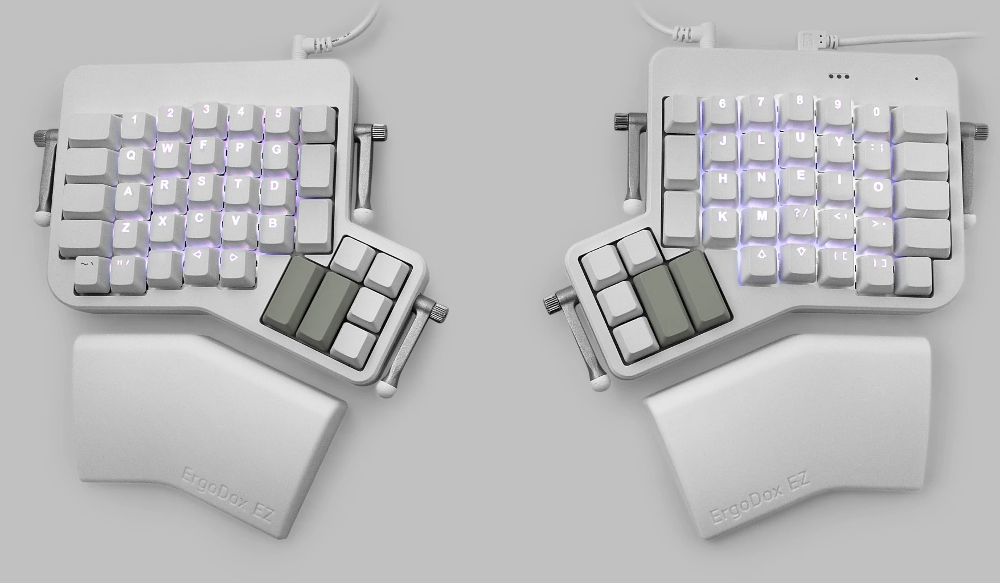][ergodox-ez]

She's pretty handsome, it had everything I wanted, bar the price tag which I couldn't justify as I had no idea if mechanical was the thing for me. Then a friend of mine when full [mitre10 kiwi][mitre10] on me and said I should try building my own, so I did.

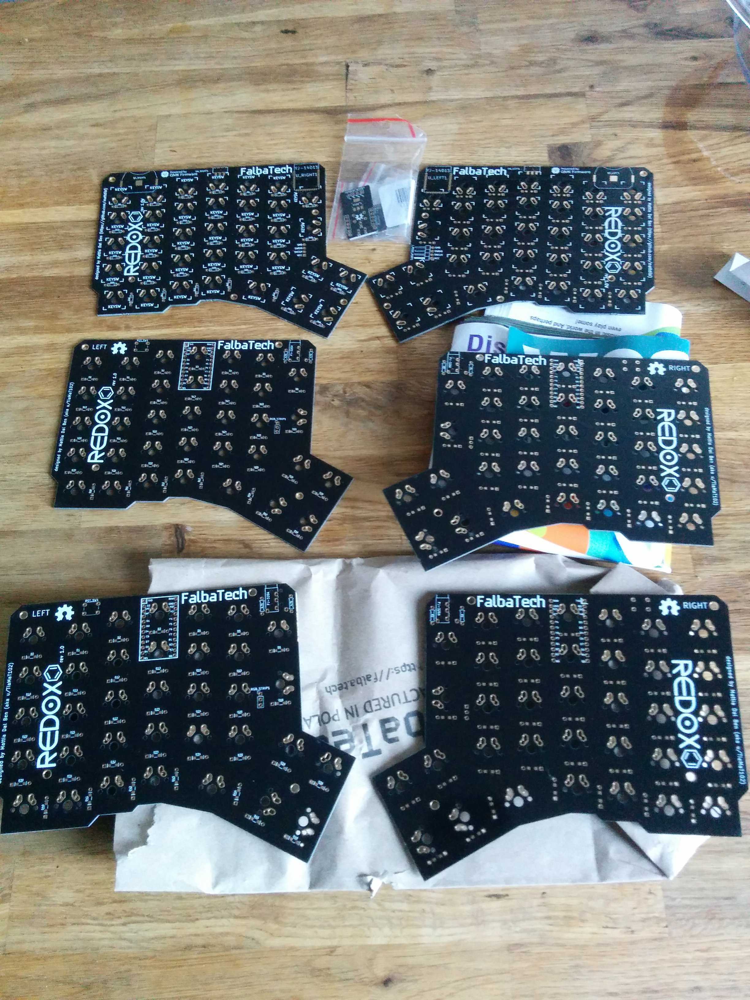]
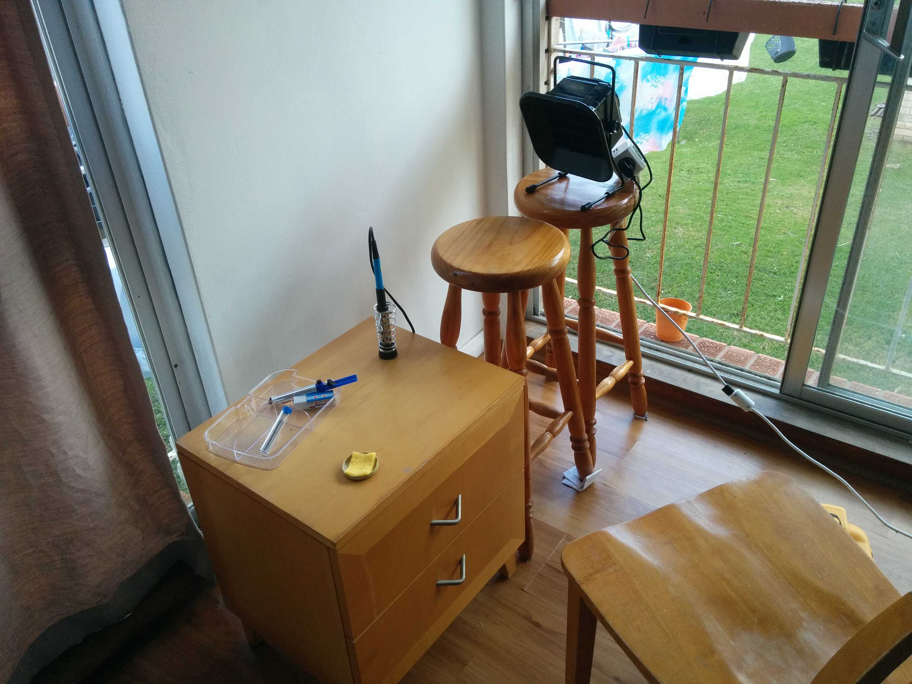]
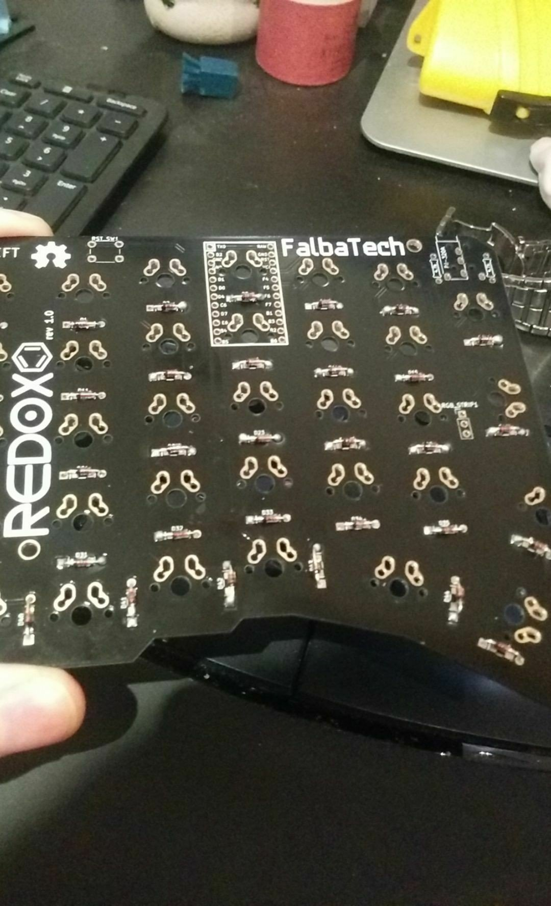]
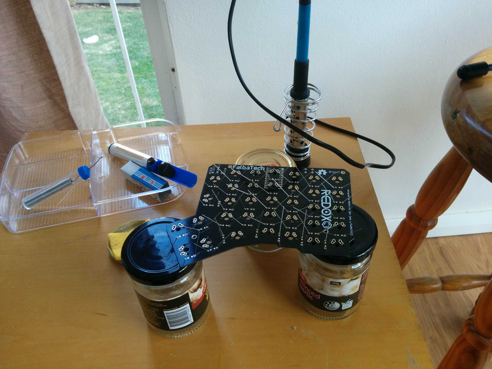]
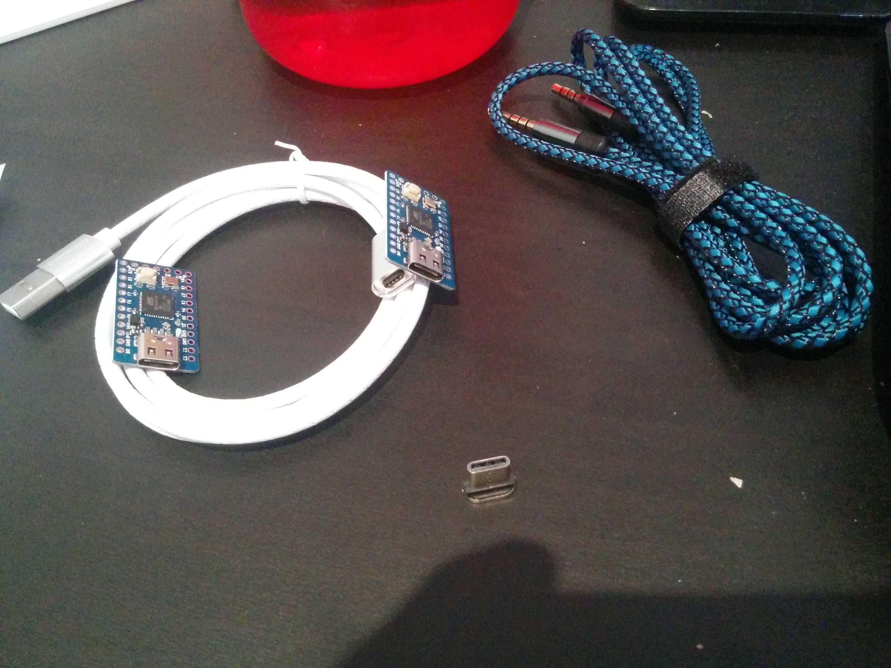]
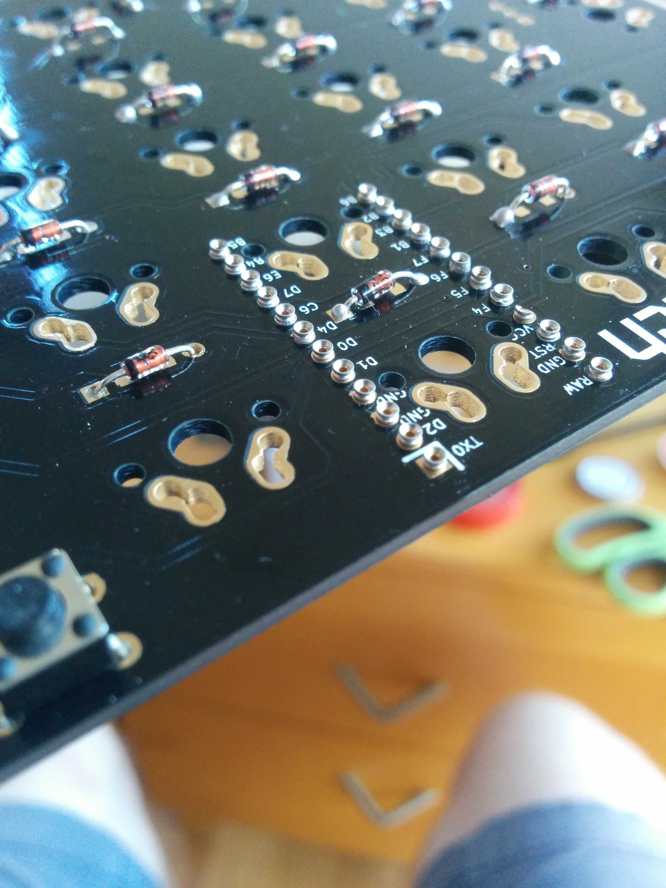]
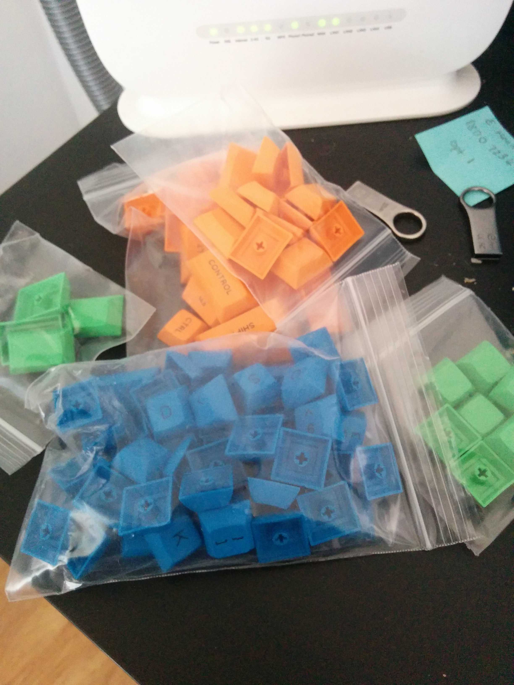]
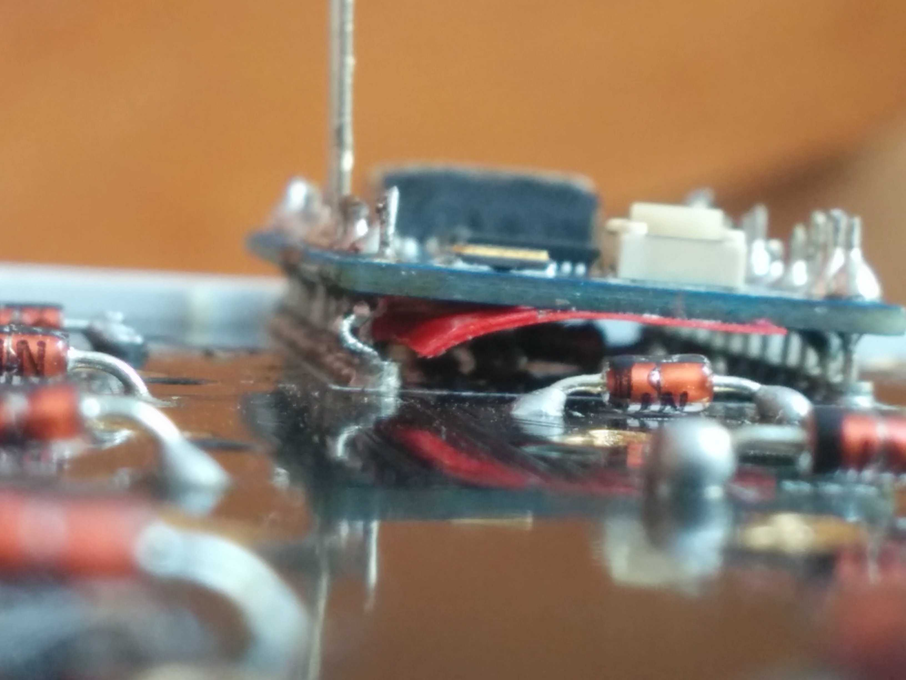]
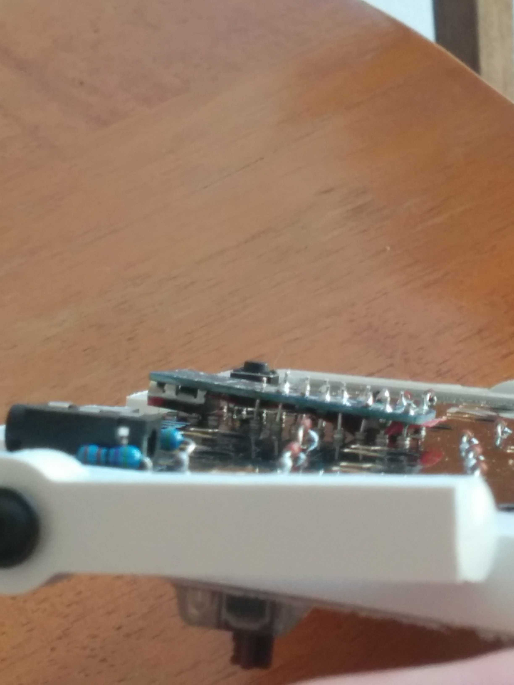]
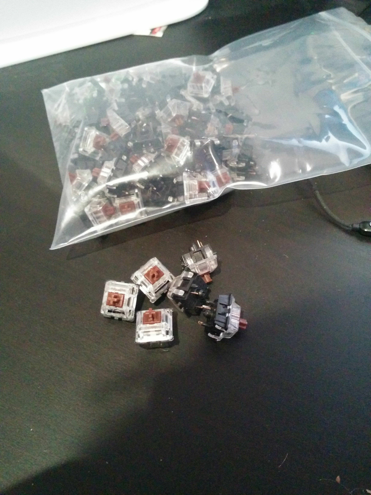]
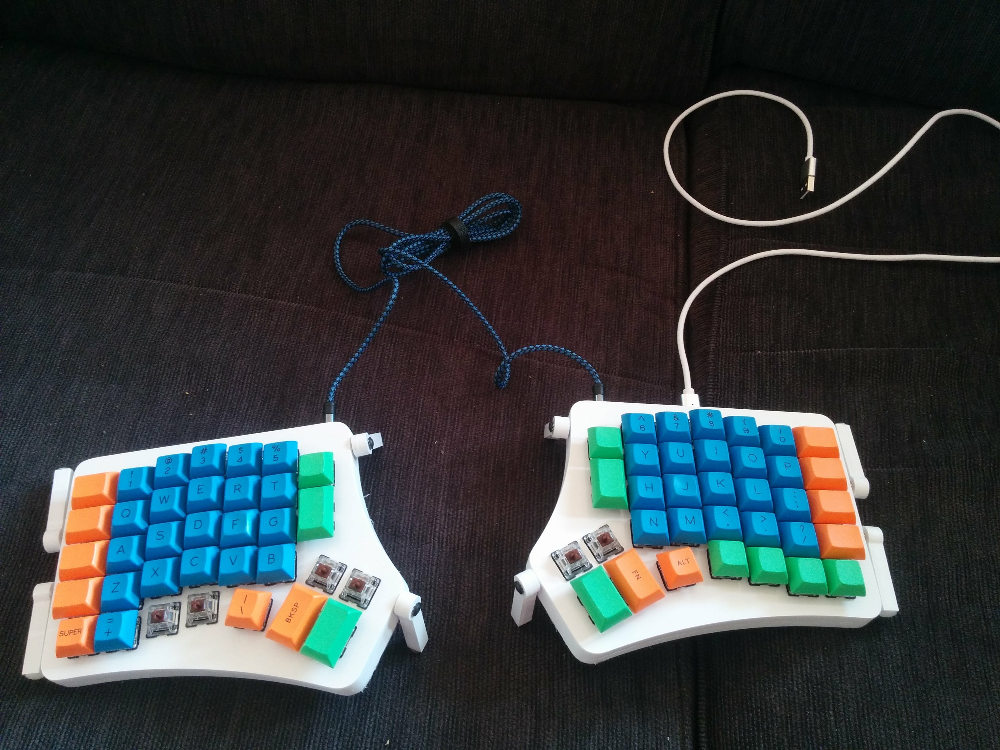]

[ergodox-ez]: https://ergodox-ez.com/
[mitre10]: https://youtu.be/UT6oZqYij8U
